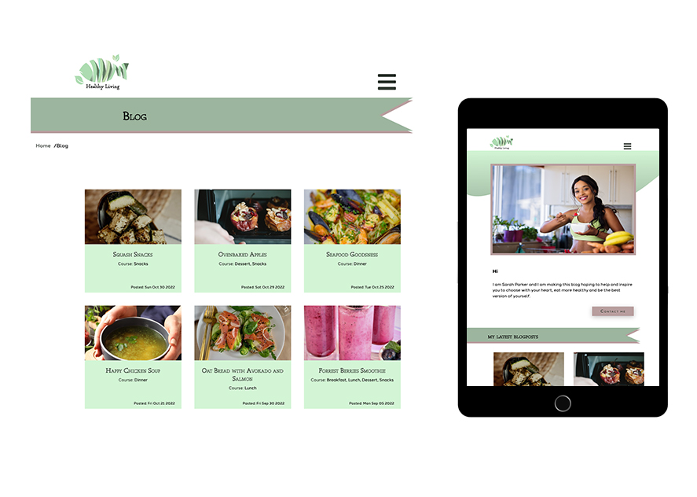

# Healthy Living Blog Site



## Assignment

Noroff semester project: 
I was tasked with making a blog site with a theme of my own choice. 
The criterias was to have at least five pages:

- Home page
- About page
- List of blogs page
- Specific blog page
- Contact page

The content for the blog is stored at Wordpress and making a call to the REST Api and fetching the data. 

## Description of the blog site

Theme for the site is healthy food and want to put a focus on animal welfare. 
This is a project made for a person who wants to run a blog site without knowing so much about the code. This way the person only need to make the recipe on Wordpress, using a plugIn for recipes, which then gets fetched to the website. 

## Built With

- [Javascript](https://www.javascript.com/)


## Visit the site

- [Healthy Living](https://healthy-living-blog.netlify.app/)

## Getting Started

### Installing

1. Clone the repo:

```bash
git clone https://github.com/Noroff-FEU-Assignments/project-exam-1-maleneivy.git
```

2. Install the dependencies:

```
npm install
```

### Running

To run the app, run the following commands:

```bash
npm run start
```

## Contact

- [My LinkedIn page](https://www.linkedin.com/in/maleneivyolsen/)

- [Discord](https://www.discordapp.com/users/2217)


## License

This project is licensed under the Creative Commons license.


